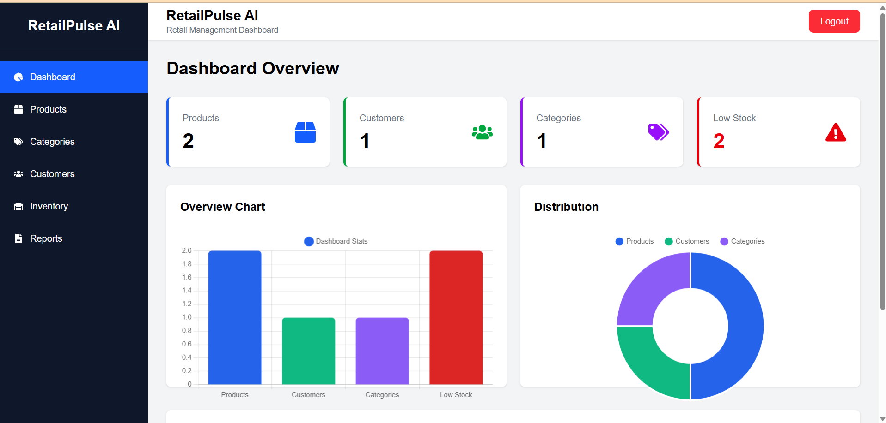

# 🛍️ RetailPulse AI

A modern **Full Stack Retail Management System** built with **React.js, Node.js, Express.js, Prisma ORM, and PostgreSQL**. It streamlines retail operations through secure authentication, inventory management, customer management, and real-time business analytics.

## ✨ Features

- 🔐 JWT Authentication
- 📦 Product Management (CRUD)
- 🏷️ Category Management
- 👥 Customer Management
- 📊 Dashboard Analytics (Chart.js)
- 📦 Inventory Tracking
- 📈 Reports Module
- 🔒 Protected Routes
- 📱 Responsive Admin Dashboard

## 🛠️ Tech Stack

**Frontend:** React.js, Tailwind CSS, React Router, Axios, Chart.js

**Backend:** Node.js, Express.js, Prisma ORM, JWT, bcrypt

**Database:** PostgreSQL

## 📸 Screenshots

| Dashboard | Products |
|-----------|----------|
|  |  |

| Customers | Inventory |
|-----------|-----------|
|  |  |

## 🚀 Installation

```bash
# Backend
cd Backend
npm install
npm run dev

# Frontend
cd Frontend
npm install
npm run dev
```

## 👩‍💻 Author

**Pushpanjali Kumari**

⭐ If you like this project, consider giving it a star!
